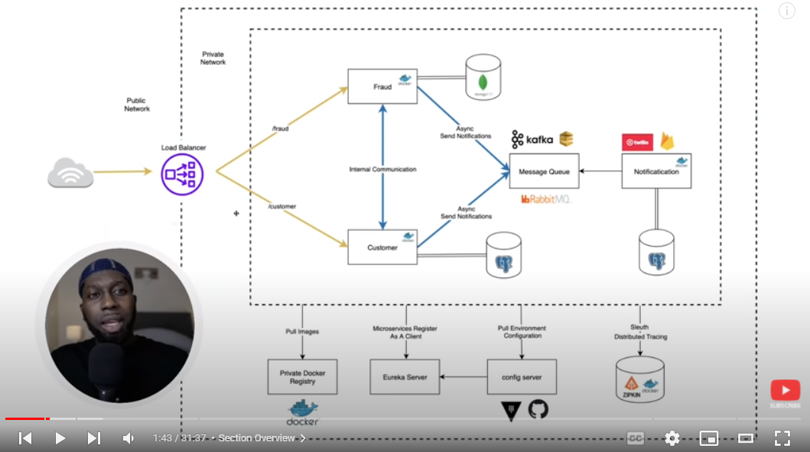

# Spring Cloud Microservices Example

taken from amigoscode with <3

- <https://www.youtube.com/watch?v=p485kUNpPvE&list=PLwvrYc43l1Mwqpf9i-1B1gXfMeHOm6DeY>
- <https://github.com/amigoscode/microservices>

## Running

    # apply environment variables
    source DEV.env

    # build and run
    mvn spring-boot:run

2. Manually create the following databases using PGAdmin:

    - `fraud`
    - `customer`

## docker (for le database)

    docker-compose up -d
    # optional below
    docker-compose ps
    docker-compose logs -f

Then visit <http://localhost:5050/> to view PGAdmin

## issues

### Invalid interpolation format

Your `docker-compose` version is probably old. Update with a binary from <https://github.com/docker/compose/releases>
